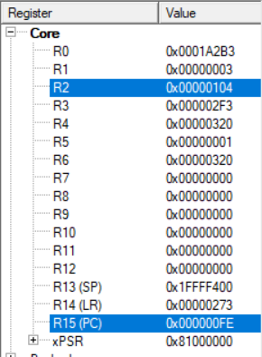
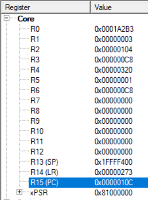
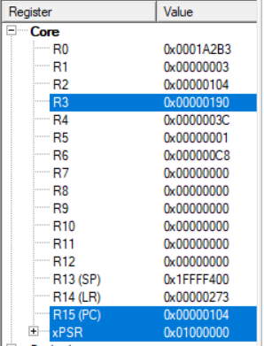
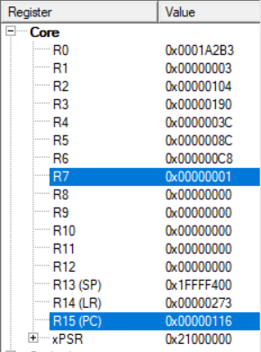

# ARM Cortex-M0+ Assembly — Parking Fee Calculator

A small ARM Thumb assembly program for the NXP MKL25Z (Cortex-M0+) that computes a
parking fee from a stay duration, then simulates coin payment until the fee is covered
and returns any change. Written and single-stepped in the Keil uVision debugger.

> **Scope (honest):** this is a **register-level assembly exercise**, not a hardware
> project. The logic runs entirely on CPU registers and is verified in the debugger —
> there is no GPIO, no timer/interrupts, and no real I/O (duration and coins are constants
> in the code). It is meant to show fluency with the ARM Thumb instruction set — conditional
> branching, register arithmetic, and control flow — not embedded board bring-up.

## What it does

1. **Load inputs** — a car ticket number and a parking duration are placed in registers
   (`R0`, `R1`).
2. **Tariff lookup** — a `CMP` / `BLT` cascade maps the duration to a fixed fee:

   | Duration | Fee |
   |---|---|
   | < 1 h | €0.50 |
   | 1–2 h | €0.95 |
   | 2–3 h | €1.70 |
   | 3–4 h | €2.60 |
   | ≥ 4 h | €3.50 |

3. **Payment loop** — €2.00 "coins" are added until the total reaches the fee, then it
   branches on `BEQ` / `BHI` / `BLT` to *exact payment*, *overpayment* (compute refund),
   or *keep paying* (compute remaining balance).
4. **Done** — `R7 = 1` signals success and the routine returns (`BX LR`).

The full source is in [`ParkingSystem.c`](ParkingSystem.c) — a single `__asm` function
(~35 Thumb instructions), commented in English.

## Register trace (Keil debugger)

The actual debugger register view, stepping through a 3-hour stay (fee €2.60) paid with two
€2.00 coins (→ €1.40 change):

<table>
  <tr>
    <td align="center" width="50%">
       
      <b>1. Fee computed</b> — <code>R2 = 0x104</code> (260c = €2.60) for a 3-hour stay
    </td>
    <td align="center" width="50%">
       
      <b>2. First coin</b> — <code>R3 = 0xC8</code> (200), still below the fee
    </td>
  </tr>
  <tr>
    <td align="center" width="50%">
       
      <b>3. Second coin</b> — <code>R3 = 0x190</code> (400) exceeds the fee; refund <code>R5 = 0x8C</code> (€1.40)
    </td>
    <td align="center" width="50%">
       
      <b>4. Success</b> — <code>R7 = 1</code>, with the €1.40 change in <code>R5</code>
    </td>
  </tr>
</table>

## Build / run

Open in **Keil uVision** targeting the **MKL25Z128VLK4** (Cortex-M0+), build, and run under
the simulator/debugger; single-step and watch the `Registers` window. The standard NXP CMSIS
startup/clock files (`startup_MKL25Z4.s`, `system_MKL25Z4.c`) are vendor boilerplate and are
not included here.

## Context

Optional assignment for the *Microprocessors & Applications* course, Electrical & Computer
Engineering, Democritus University of Thrace.

## License

MIT — see [LICENSE](LICENSE).
